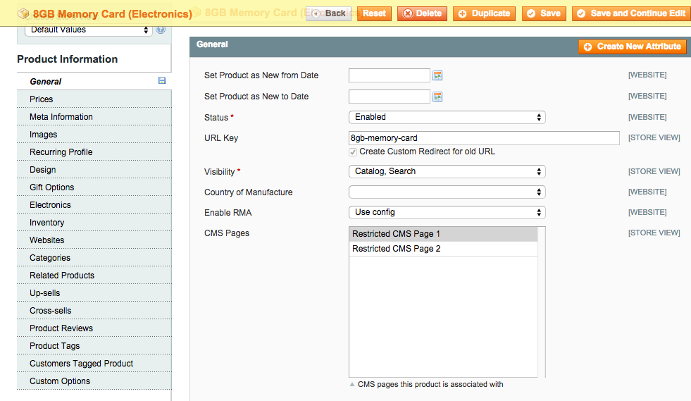

CmsCustomer
===========

Lets you restrict access to specific CMS pages to customers who have bought specific products.
When the user comes to a restricted page, if the user is not logged in, she will be redirected 
to an unauthorized page. If the user is logged in, but the user has not bought the product 
associated with the page, she will be redirected to the unauthorized page. If the user has 
bought a product associated with the page, she will be allowed to stay on the page.

How to use
----------

Upload the files to your website, turn off compilation, clear cache, etc. Let the setup script 
run. The catalog attribute *page_ids* will be created and a multiselect element added to the 
General tab of the product admin. For each CMS page you want restricted to customers who have 
bought specific products, select that page's ID in the product admin:

